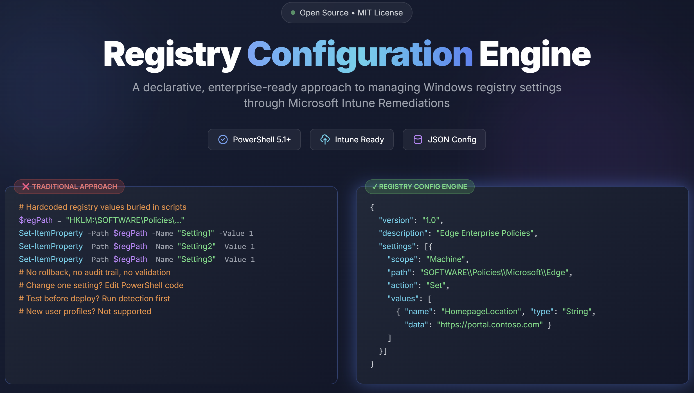

# Registry Configuration Engine for Microsoft Intune

A declarative, flexible approach to managing Windows registry settings through Microsoft Intune Remediations.

[](https://haakonwibe.github.io/registry-configuration-engine-v1/poster.html)
   
*Click the image to view the interactive poster*

## 🎯 Overview

The Registry Configuration Engine uses **JSON configuration files** to define registry settings, separating the "what" from the "how". This approach offers several advantages over traditional embedded-configuration scripts:

| Feature | Traditional Approach | Registry Config Engine |
|---------|---------------------|----------------------|
| Configuration | Embedded in script | External JSON (version-controllable) |
| Rollback | Not available | Transaction log with undo capability |
| Default User Profile | Not supported | ✅ Applies to new user profiles |
| Testing | Run detection first | Built-in `-WhatIf` validation |
| Logging | Script output only | Windows Event Log + transcripts |
| Maintenance | Edit PowerShell | Edit JSON (no coding required) |

## 📁 Repository Structure

```
RegistryConfigEngine/
├── Invoke-RegistryConfigEngine.ps1   # Main engine script
├── New-IntunePackage.ps1             # Packages configs for Intune deployment
├── ConvertFrom-RegistryExport.ps1    # Converts .reg files to JSON configs
├── README.md                          # This file
├── CLAUDE.md                          # AI assistant instructions
├── LICENSE                            # MIT License
├── schema/
│   └── registry-config-v1.json       # JSON schema for editor validation
├── docs/
│   ├── poster.html                   # Interactive visual overview
│   └── images/
│       └── poster-preview.png        # Poster preview image
├── Configs/                           # Sample configuration files
│   ├── 01-corporate-branding.json    # Basic corporate settings
│   ├── 02-outlook-fonts.json         # Outlook font config (binary values)
│   ├── 03-edge-enterprise.json       # Microsoft Edge policies
│   ├── 04-onedrive-kfm.json          # OneDrive Known Folder Move
│   ├── 05-windows-explorer.json      # Explorer preferences
│   ├── 06-cleanup-delete.json        # Delete/cleanup examples
│   ├── 07-teams-enterprise.json      # Teams configuration
│   ├── 08-prefer-ipv4.json           # IPv4 over IPv6 preference
│   ├── 09-comparison-operators.json  # Comparison operators examples
│   ├── 10-browser-detection.json     # Detect Firefox/Brave installation
│   ├── 11-global-secure-access-production.json  # GSA production config
│   ├── 12-global-secure-access-developer.json   # GSA developer config
│   ├── 13-adobe-reader-hardening.json    # Adobe Reader DC security hardening
│   └── 14-adobe-acrobat-hardening.json   # Adobe Acrobat Pro/Standard hardening
├── ExamplePackages/                   # Pre-generated Intune script examples
│   ├── README.md                     # Usage instructions
│   ├── PreferIPv4-Detect.ps1         # Simple example - detection
│   ├── PreferIPv4-Remediate.ps1      # Simple example - remediation
│   ├── ComparisonOperators-Detect.ps1    # Advanced example - detection
│   └── ComparisonOperators-Remediate.ps1 # Advanced example - remediation
└── Packages/                          # Your generated packages (gitignored)
```

## 🚀 Quick Start

### 1. Create Your Configuration

**Option A: Write from scratch**

Create a JSON file with your desired settings:

```json
{
  "version": "1.0",
  "author": "Your Name",
  "description": "My corporate registry settings",
  "settings": [
    {
      "name": "Corporate Branding",
      "scope": "User",
      "path": "SOFTWARE\\MyCompany\\Settings",
      "action": "Set",
      "values": [
        { "name": "Configured", "type": "DWord", "data": 1 },
        { "name": "ConfigDate", "type": "String", "data": "{{DATE}}" }
      ]
    }
  ]
}
```

**Option B: Convert from a Registry Export**

Export settings from a test machine and convert to JSON:

```powershell
# Export settings from Windows Registry
regedit /e "C:\temp\settings.reg" "HKEY_LOCAL_MACHINE\SOFTWARE\Policies\Microsoft\Edge"

# Convert .reg file to JSON configuration
.\ConvertFrom-RegistryExport.ps1 -Path ".\settings.reg"

# Or specify output path and scope
.\ConvertFrom-RegistryExport.ps1 -Path ".\settings.reg" -OutputPath ".\edge-config.json" -Scope Machine
```

### 2. Test Locally

```powershell
# Validate the configuration
.\Invoke-RegistryConfigEngine.ps1 -ConfigPath ".\Configs\01-corporate-branding.json" -Mode Validate

# Check compliance (detection)
.\Invoke-RegistryConfigEngine.ps1 -ConfigPath ".\Configs\01-corporate-branding.json" -Mode Detect

# Preview changes without applying
.\Invoke-RegistryConfigEngine.ps1 -ConfigPath ".\Configs\01-corporate-branding.json" -Mode Remediate -WhatIf

# Apply changes
.\Invoke-RegistryConfigEngine.ps1 -ConfigPath ".\Configs\01-corporate-branding.json" -Mode Remediate

# Verbose output for debugging
.\Invoke-RegistryConfigEngine.ps1 -ConfigPath ".\Configs\01-corporate-branding.json" -Mode Detect -Verbose
```

**Rollback (Local Testing Only)**

All changes are logged to `C:\ProgramData\RegistryConfigEngine\Transactions\`. Use rollback to undo changes during development:

```powershell
# List available transaction logs
Get-ChildItem "$env:ProgramData\RegistryConfigEngine\Transactions\*.json"

# Rollback a specific remediation
.\Invoke-RegistryConfigEngine.ps1 -ConfigPath "C:\ProgramData\RegistryConfigEngine\Transactions\Transaction_20260129_143000.json" -Mode Rollback
```

> **Note:** Rollback is intended for local development and testing. For production, create a reverse configuration (using `Delete` action or restoring default values) and deploy it as a new Intune remediation.

### 3. Deploy via Intune

**Option A: Package with New-IntunePackage.ps1 (Recommended)**

```powershell
# Generate detection and remediation scripts
.\New-IntunePackage.ps1 -ConfigPath ".\Configs\01-corporate-branding.json"

# Custom output location and prefix
.\New-IntunePackage.ps1 -ConfigPath ".\Configs\01-corporate-branding.json" -OutputPath ".\Packages" -Prefix "CorporateBranding"

# Enable Windows Event Log logging
.\New-IntunePackage.ps1 -ConfigPath ".\Configs\01-corporate-branding.json" -CreateEventLog
```

This creates self-contained `*-Detect.ps1` and `*-Remediate.ps1` files with the configuration embedded. Use `-CreateEventLog` to also write to the Windows Event Log (Application log, source: `RegistryConfigEngine`).

**Option B: URL-Based Configuration (Advanced)**

The engine supports loading configurations from URLs:

```powershell
.\Invoke-RegistryConfigEngine.ps1 -ConfigPath "https://storage.blob.core.windows.net/configs/my-config.json" -Mode Detect
```

1. Host your JSON on a web server or Azure Blob Storage (with public access or SAS token)
2. Point the script to the URL
3. Centrally update configurations without redeploying scripts

> **Note:** Ensure the URL is accessible from managed devices. Azure Blob Storage with SAS tokens works well for this scenario.

## 📋 Configuration Reference

### JSON Structure

```json
{
  "$schema": "https://alttabtowork.com/schemas/registry-config-v1.json",
  "version": "1.0",
  "author": "Author Name",
  "description": "Configuration description",
  "created": "2026-01-28",
  "notes": ["Optional notes array"],
  "settings": [
    {
      "name": "Setting Group Name",
      "description": "What this group does",
      "scope": "User|Machine|DefaultUser",
      "path": "SOFTWARE\\Path\\To\\Key",
      "action": "Set|Delete|DeleteKey",
      "rebootRequired": false,
      "values": [
        {
          "name": "ValueName",
          "type": "String|DWord|QWord|Binary|MultiString|ExpandString",
          "data": "value",
          "comparison": "Equals",
          "skipDetection": false
        }
      ]
    }
  ]
}
```

### Scopes

| Scope | Description | Registry Location |
|-------|-------------|-------------------|
| `Machine` | Machine-wide settings | `HKLM:\` |
| `User` | All existing user profiles | `HKU:\<SID>\` (enumerated) |
| `DefaultUser` | Template for new users | `C:\Users\Default\NTUSER.DAT` |

### Actions

| Action | Description |
|--------|-------------|
| `Set` | Create or update registry values |
| `Delete` | Remove specific registry values |
| `DeleteKey` | Remove entire registry key and contents |

### Setting Options

| Option | Type | Default | Description |
|--------|------|---------|-------------|
| `name` | string | (required) | Display name for the setting group |
| `description` | string | (optional) | Description of what the setting does |
| `scope` | string | (required) | Target scope (see Scopes above) |
| `path` | string | (required) | Registry path (without hive prefix) |
| `action` | string | (required) | Action to perform (see Actions above) |
| `rebootRequired` | bool | `false` | Show a toast notification to the user after remediation indicating a reboot is needed |
| `values` | array | (required) | Array of registry values to set/delete |

### Value Types

| Type | Example Data |
|------|-------------|
| `String` | `"Hello World"` |
| `ExpandString` | `"%USERPROFILE%\\Documents"` |
| `DWord` | `1` or `0` |
| `QWord` | `12345678901234` |
| `Binary` | `"3C,00,00,00"` or `[60, 0, 0, 0]` |
| `MultiString` | `["Value1", "Value2"]` |

### Value Options

| Option | Type | Default | Description |
|--------|------|---------|-------------|
| `name` | string | (required) | Registry value name |
| `type` | string | (required*) | Registry value type (see above). *Not required for `NotExists` comparison. |
| `data` | varies | (required*) | Value to set. *Not required for `Exists` or `NotExists` comparison. |
| `comparison` | string | `Equals` | Comparison operator for detection (see below) |
| `skipDetection` | bool | `false` | Skip this value during detection. Useful for timestamps like `{{DATETIME}}` that change on each run. |

### Comparison Operators

Comparison operators allow flexible detection logic beyond exact equality. Detection uses the specified operator; remediation always sets the `data` value (except `NotExists` which deletes the value).

| Operator | Applicable Types | Description |
|----------|------------------|-------------|
| `Equals` | All | Exact match (default) |
| `NotEquals` | All | Value differs from specified |
| `GreaterThan` | DWord, QWord | Value > specified |
| `GreaterThanOrEqual` | DWord, QWord | Value >= specified |
| `LessThan` | DWord, QWord | Value < specified |
| `LessThanOrEqual` | DWord, QWord | Value <= specified |
| `Contains` | String | String contains substring |
| `StartsWith` | String | String starts with prefix |
| `EndsWith` | String | String ends with suffix |
| `Exists` | All | Value exists (any data) |
| `NotExists` | All | Value must not exist (remediation deletes) |

**Example use cases:**
- `GreaterThanOrEqual`: Ensure a security baseline version is at least X
- `Contains`: Verify a URL includes a specific domain
- `NotExists`: Ensure a legacy or debug setting has been removed
- `Exists`: Verify a configuration value is present (any value acceptable)

### Dynamic Variables

Use these placeholders in string values - they're expanded at runtime:

| Variable | Description | Example Output |
|----------|-------------|----------------|
| `{{DATE}}` | Current date | `2026-01-28` |
| `{{DATETIME}}` | Current date/time | `2026-01-28 14:30:00` |
| `{{COMPUTERNAME}}` | Computer name | `DESKTOP-ABC123` |
| `{{USERNAME}}` | Current username | `jsmith` |
| `{{DOMAIN}}` | Domain/workgroup | `CONTOSO` |
| `{{OSVERSION}}` | Windows version | `10.0.22631.0` |
| `{{ENGINEVERSION}}` | Script version | `1.0.0` |

> **Tip**: For values using `{{DATETIME}}`, add `"skipDetection": true` to prevent false non-compliance reports. Since the time changes each run, the value written during remediation will never match the expected value during detection.

## 🔧 Deployment to Intune

### Embedding Configuration (Recommended for Most Users)

For Intune deployment, embed your JSON directly in the script:

1. Open `Invoke-RegistryConfigEngine.ps1`
2. Find the `#region Main Execution` section
3. Add your embedded config before the `try` block:

```powershell
# Embedded configuration for Intune deployment
$EmbeddedConfig = @'
{
  "version": "1.0",
  "settings": [
    // Your configuration here
  ]
}
'@

# Save to temp file
$TempConfigPath = Join-Path $env:TEMP "RegistryConfig_$(Get-Random).json"
$EmbeddedConfig | Out-File -FilePath $TempConfigPath -Encoding UTF8
$ConfigPath = $TempConfigPath
```

4. Create two copies:
   - **Detection**: Set `$Mode = 'Detect'` at the top
   - **Remediation**: Set `$Mode = 'Remediate'` at the top

### Intune Remediation Settings

| Setting | Value |
|---------|-------|
| Run this script using logged-on credentials | **No** |
| Run script in 64-bit PowerShell | **Yes** |
| Enforce script signature check | Per your policy |
| Run script silently | **Yes** |

### Monitoring

After deployment, check compliance in Intune:
- **Devices** → **Monitor** → **Remediations**
- Look for output starting with `[REGENGINE]`

Output examples:
- ✅ `[REGENGINE] COMPLIANT - All settings are correct`
- ⚠️ `[REGENGINE] NON-COMPLIANT - 3 setting(s) need remediation`
- ✅ `[REGENGINE] SUCCESS - 3 change(s) applied`

## 🔒 Security Considerations

### Running as SYSTEM

The script is designed to run as SYSTEM through Intune. This provides:

- Access to all user registry hives via HKU enumeration
- Works in environments with AppLocker/WDAC policies
- Avoids Constrained Language Mode restrictions
- No dependency on logged-on user context

### Transaction Logging

All changes are logged to:
```
C:\ProgramData\RegistryConfigEngine\Transactions\Transaction_YYYYMMDD_HHMMSS.json
```

This enables:
- Audit trail of all changes
- Rollback capability via `-Mode Rollback`
- Troubleshooting failed remediations

### Supported SIDs

The engine processes both:
- **Active Directory SIDs**: `S-1-5-21-*`
- **Entra ID (Azure AD) SIDs**: `S-1-12-1-*`

This ensures compatibility with:
- Traditional AD-joined devices
- Entra ID joined devices
- Hybrid joined devices

## 🐛 Troubleshooting

### Common Issues

**"Configuration file not found"**
- Ensure the JSON file exists at the specified path
- For embedded configs, verify the JSON is valid

**"Cannot load Default User hive"**
- Script must run elevated (as SYSTEM or Administrator)
- Another process may have the hive locked

**Binary values not matching**
- Verify hex format: comma-separated (e.g., `"3C,00,00,00"`)
- Check for leading/trailing whitespace

### Debug Mode

Run with verbose output:
```powershell
.\Invoke-RegistryConfigEngine.ps1 -ConfigPath ".\config.json" -Mode Detect -Verbose
```

### Event Log

If `-CreateEventLog` is specified, check:
- **Event Viewer** → **Application** → Source: `RegistryConfigEngine`

## 📝 Sample Configurations

Ready-to-use configuration files in the `Configs/` folder:

| File | Description |
|------|-------------|
| `01-corporate-branding.json` | Basic corporate identification settings |
| `02-outlook-fonts.json` | Outlook font configuration (binary values) |
| `03-edge-enterprise.json` | Microsoft Edge enterprise policies |
| `04-onedrive-kfm.json` | OneDrive Known Folder Move setup |
| `05-windows-explorer.json` | File Explorer preferences |
| `06-cleanup-delete.json` | Delete/cleanup operation examples |
| `07-teams-enterprise.json` | Microsoft Teams configuration |
| `08-prefer-ipv4.json` | Prefer IPv4 over IPv6 |
| `09-comparison-operators.json` | Demonstrates comparison operators for flexible detection |
| `10-browser-detection.json` | Detect Firefox/Brave browser installations |
| `11-global-secure-access-production.json` | Global Secure Access - production (restricted) |
| `12-global-secure-access-developer.json` | Global Secure Access - developer (full control) |
| `13-adobe-reader-hardening.json` | Adobe Reader DC security hardening |
| `14-adobe-acrobat-hardening.json` | Adobe Acrobat Pro/Standard DC security hardening |

## 🤝 Contributing

Contributions are welcome! Please:

1. Test configurations thoroughly before submitting
2. Include comments explaining non-obvious settings
3. Follow the established JSON structure
4. Update documentation for new features

## ⚠️ Disclaimer

This tool is provided as-is, without warranty of any kind. Use at your own risk.

- Always test configurations in a non-production environment first
- Review generated scripts before deploying to Intune
- The authors are not liable for any damage or issues caused by using this tool

By using this software, you accept full responsibility for any changes made to your systems.

## 📜 License

MIT License - See LICENSE file for details.

## 🙏 Acknowledgments

This project was inspired by the community's work on registry management via Intune, particularly Martin Bengtsson's approach at [imab.dk](https://www.imab.dk). This implementation takes a different architectural approach using external JSON configuration for better maintainability and enterprise deployment flexibility.

## 📫 Contact

- **Blog**: [Alt Tab to Work](https://alttabtowork.com)
- **Author**: Haakon Wibe

---

*Built for the Digital Workplace community* 🚀
